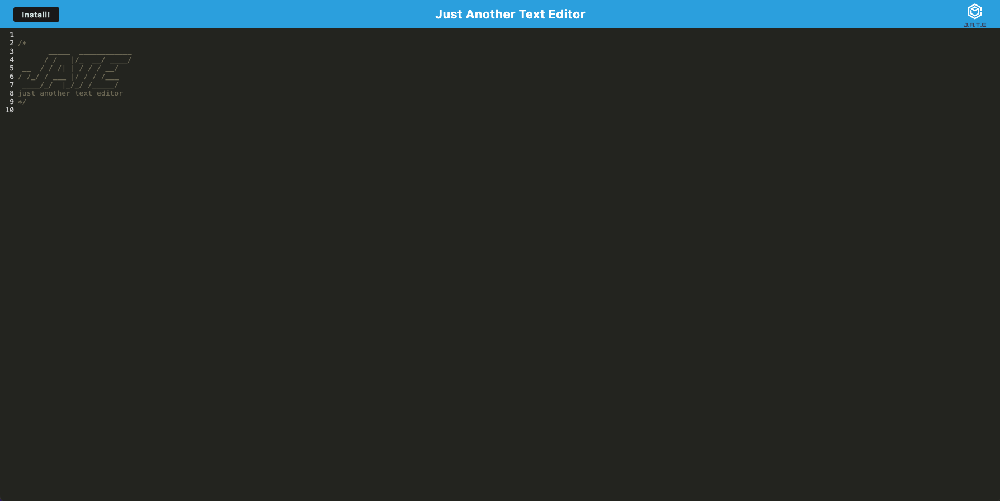

# ProgressiveWebApp-TextEditor

## Description

This project presents a modern text editor that works as a Progressive Web Application (PWA), running smoothly in your browser. It's built to the high standards of a PWA, with features that save your data in different ways, making it a reliable tool for developers to create and manage notes or code snippets with or without an internet connection.

## Features

* PWA Compliance: Designed as a Progressive Web Application, allowing for offline use and enhancing user experience.

* Data Persistence: Utilizes IndexedDB with idb for data storage, ensuring your work is saved and retrievable anytime.
* Full-Stack Solution: A comprehensive application with both client and server-side functionalities, ready for deployment.
* Deployment Ready: Configured for deployment on Render with a simple process, ensuring your application is accessible worldwide.
* Modern Web Technologies: Uses webpack for bundling, Babel for next-gen JavaScript, and Workbox for service worker creation, embracing the latest in web development standards.
* Intuitive UI: Features an easy-to-navigate user interface, with clean and polished design elements, mirroring the provided mock-ups.

## Usage

To use the application, simply open the deployed URL in your browser. You can create, edit, and save text snippets or code notes. For added convenience, consider installing the application on your desktop for easy access.

## Screenshots

Here is a some screenshot demonstrating the application:

## Links

Deployed Application: https://progressivewebapp-texteditor.onrender.com

For further questions or contributions, please feel free to reach out!

## Credits
Thank you for the tips and suggestionsm from Bootcamp instructors, learning assistants, classmates, and resources. Thank you to my tutor Rene for assisting me in refining my code. I have used http: //www.w3schools.com/ and http://www.stackoverflow.com, and https://chat.openai.com to research information. Lastly,thanks to OpenAI's Chatgpt-4 for assistance in creating this README.md template. 